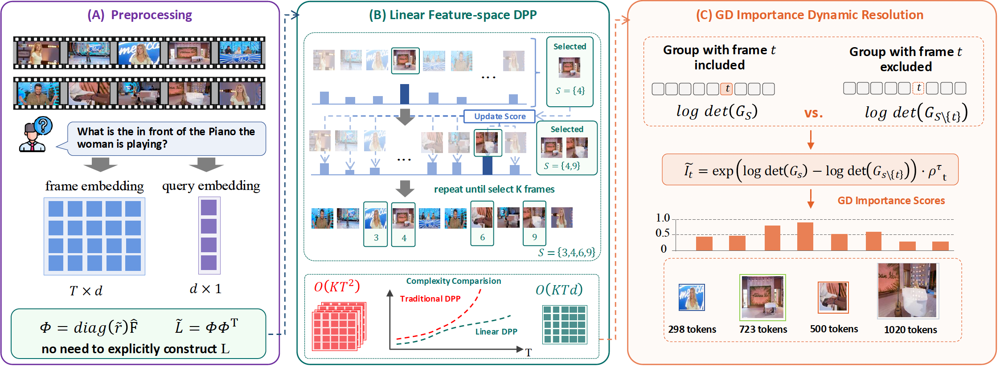

# LDDR: Linear-DPP-Based Dynamic-Resolution Frame Sampling for Video MLLMs
<p align="center">
  
</p>

This repository is a cleaned and minimalized `lmms-eval` fork for running our dynamic-resolution video evaluation method on Qwen2.5-VL.

The repository keeps three core pieces:
- the `lmms-eval` evaluation framework
- our Qwen2.5-VL method implementation
- a runnable example script for dynamic-resolution evaluation

## What This Repo Runs

Our method is implemented in:
- `lmms_eval/models/chat/qwen2_5_vl_chat_wo_ours_v4.py`

It is built on top of:
- `lmms_eval/models/simple/qwen2_5_vl.py`

The dynamic-resolution path is the default path in the current implementation of `qwen2_5_vl_chat_wo_ours_v4`.

## Supported Benchmarks

This cleaned version is prepared for the following video benchmarks:
- `longvideobench_val_v`

Relevant task configs are under:
- `lmms_eval/tasks/longvideobench/`

## Installation

We recommend using a fresh Python or conda environment.

```bash
git clone <your-repo-url>
cd lmms-eval
pip install -e .
```

If you want a dedicated environment:

```bash
conda create -n lmms-eval python=3.10 -y
conda activate lmms-eval
pip install -e .
```

## Required Models and Assets

### 1. Qwen2.5-VL checkpoint

Set `PRETRAINED_PATH` to either:
- a local checkpoint directory, or
- a Hugging Face model id such as `Qwen/Qwen2.5-VL-7B-Instruct`

Example:

```bash
export PRETRAINED_PATH=/path/to/Qwen2.5-VL-7B-Instruct
```

### 2. CLIP encoder

By default the code uses:

```bash
sentence-transformers/clip-ViT-L-14
```

You can override it if needed:

```bash
export CLIP_MODEL_PATH=/path/to/clip-ViT-L-14
```

### 3. LongCLIP checkpoint

The method uses LongCLIP for frame-text relevance encoding when `use_longclip=True`.

By default the code looks for:

```bash
lmms_eval/models/simple/Longclip/checkpoints/longclip-L.pt
```

You can override it with:

```bash
export LONGCLIP_DIR=/path/to/Longclip
export LONG_CLIP_MODEL_PATH=/path/to/Longclip/checkpoints/longclip-L.pt
```

## Data Preparation

### LongVideoBench

This task caches to:
- `./data/cache/huggingface/datasets/LongVideoBench`

## Quick Start

The main example script is:

```bash
bash examples/models/qwen25vl.sh
```

This script runs:
- model: `qwen2_5_vl_chat_wo_ours_v4`
- task: `videomme` by default
- dynamic-resolution frame selection

### Minimal example

```bash
export PRETRAINED_PATH=/path/to/Qwen2.5-VL-3B-Instruct
export TASK_NAME=videomme
export OUTPUT_PATH=./outputs/videomme

bash examples/models/qwen25vl.sh
```

### Run another benchmark

```bash
export PRETRAINED_PATH=/path/to/Qwen2.5-VL-3B-Instruct
export TASK_NAME=longvideobench_val_v
export OUTPUT_PATH=./outputs/longvideobench_val_v

bash examples/models/qwen25vl.sh
```

### Run with custom frame and token budget

```bash
export PRETRAINED_PATH=/path/to/Qwen2.5-VL-3B-Instruct
export TASK_NAME=mlvu_dev
export MAX_NUM_FRAMES=8
export TARGET_TOKEN_PER_FRAME=1024
export MIN_TOKEN_PER_FRAME=256
export MAX_TOKEN_PER_FRAME=1024
export OUTPUT_PATH=./outputs/mlvu_dev

bash examples/models/qwen25vl.sh
```

## Important Runtime Arguments

The example script exposes the following environment variables:

- `TASK_NAME`: benchmark name
- `PRETRAINED_PATH`: Qwen2.5-VL model path or HF model id
- `OUTPUT_PATH`: output directory
- `NUM_PROCESSES`: number of processes for `accelerate`
- `BATCH_SIZE`: eval batch size
- `MAX_NUM_FRAMES`: frame budget before dynamic reallocation
- `TARGET_TOKEN_PER_FRAME`: nominal token budget per frame
- `MIN_TOKEN_PER_FRAME`: minimum token budget for selected frames
- `MAX_TOKEN_PER_FRAME`: maximum token budget for selected frames
- `ATTN_IMPLEMENTATION`: e.g. `flash_attention_2`
- `USE_LONGCLIP`: whether to enable LongCLIP-based frame scoring

Example:

```bash
export TASK_NAME=longvideobench_val_v
export PRETRAINED_PATH=/path/to/Qwen2.5-VL-7B-Instruct
export NUM_PROCESSES=1
export BATCH_SIZE=1
export MAX_NUM_FRAMES=8
export TARGET_TOKEN_PER_FRAME=1024
export MIN_TOKEN_PER_FRAME=256
export MAX_TOKEN_PER_FRAME=1024
export USE_LONGCLIP=True
export OUTPUT_PATH=./outputs/longvideobench_val_v

bash examples/models/qwen25vl.sh
```

## Dynamic-Resolution Notes

Our dynamic-resolution path is implemented inside:
- `lmms_eval/models/chat/qwen2_5_vl_chat_wo_ours_v4.py`

The high-level flow is:
1. Encode frame-text relevance with CLIP or LongCLIP.
2. Select frames with DPP-style pruning.
3. Allocate different token budgets to different selected frames.
4. Convert token budgets into per-frame resized height and width.
5. Feed resized images into Qwen2.5-VL through `qwen_vl_utils`.

In other words, different selected frames can receive different effective resolutions under the same overall visual budget.

## Useful Environment Variables

Optional overrides:

```bash
export CLIP_MODEL_PATH=/path/to/clip-ViT-L-14
export LONGCLIP_DIR=/path/to/Longclip
export LONG_CLIP_MODEL_PATH=/path/to/Longclip/checkpoints/longclip-L.pt
export LMMS_EVAL_CLIP_CACHE=./data/cache/clip-cache
export HF_TOKEN=<your_hf_token_if_needed>
```

## Output

Results are written to `OUTPUT_PATH`.

Typical outputs include:
- final metrics json
- optional sample-level outputs if you enable sample logging

## Main Files

- `examples/models/qwen25vl.sh`: example entry script
- `lmms_eval/models/chat/qwen2_5_vl_chat_wo_ours_v4.py`: our Qwen2.5-VL dynamic-resolution method
- `lmms_eval/models/simple/qwen2_5_vl.py`: Qwen2.5-VL base wrapper
- `lmms_eval/tasks/*`: benchmark configs

## Common Issues

### LongCLIP checkpoint not found

Set:

```bash
export LONG_CLIP_MODEL_PATH=/path/to/longclip-L.pt
```

### LVBench path not found

Prepare local files under:

```bash
./data/lvbench/data
```

or update:

```bash
lmms_eval/tasks/lvbench/lvbench.yaml
```

### Hugging Face dataset access error

If a dataset requires authentication:

```bash
export HF_TOKEN=<your_token>
```

Do not hard-code tokens into scripts.

## Citation

If you use this repository, please cite the corresponding project or paper for the dynamic-resolution Qwen2.5-VL evaluation method.
